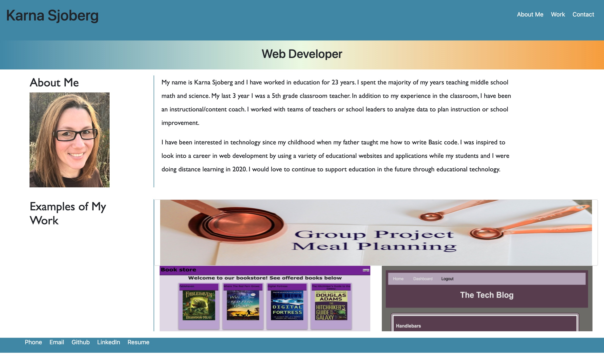

# Homework 16: Updated Portfolio #2

## Table of Contents
* [Description](#description)
* [License](#license)
* [Contributing](#contributing)
* [Questions](#questions)
* [Link to Github](#link-to-github-repository)
* [Link to Deployed Code](#link-to-deployed-code-on-github)
  
## Description
The objective of this assignment is to update our portfolios to include our for group project and 2 of our exemplary homework assignments. I also included updated links to my GitHub page, my LinkedIn profile and the PDF of my Resume. 

I added bootstrap to the technologies used to help with the formatting of the About Me and Examples of my Work sections. 

## License
This project is licensed through MIT.

## Contributing
Please reach out to me if you would like to contribute to my project by email.

## Questions
If you have any questions, please contact me at sjobergkarna@gmail.com or on GitHub with this link [kesjoberg](https://github.com/kesjoberg).

## Screenshot of my deployed paged

## Link to GitHub Repository
https://github.com/kesjoberg/portfolio

## Link to Deployed Code on Github
https://kesjoberg.github.io/portfolio/

